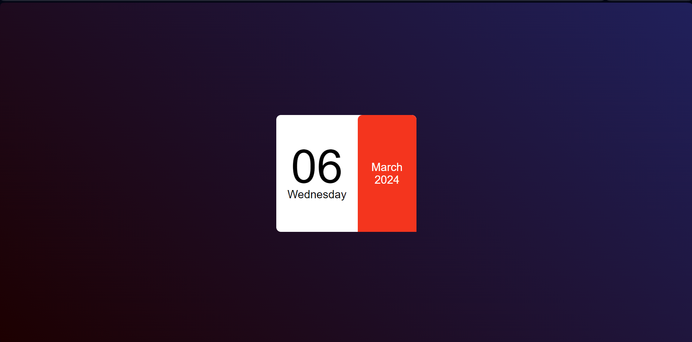

# Mini Calendar 📅

## Overview
The *Mini Calendar* is a simple and stylish web application that displays the current date, day, month, and year in a compact format. The interface is designed with a gradient background and a split layout for an elegant appearance.

## Technologies Used 🚀
- **HTML**
- **CSS**
- **JavaScript**

## Features 🌟
- Displays the current date, day, month, and year.
- Gradient background for an attractive visual appeal.
- Responsive design for various screen sizes.

## Usage 💻
Simply open the HTML file in a web browser, and the Mini Calendar will show you the current date information.

## Live Demo 🌐
Check out the live demo: [Mini Calendar Demo](#) <!-- Add your live demo link -->

## Installation 🛠️
1. Clone the repository: `git clone https://github.com/Eraycann/Mini-Calendar`
2. Open the project folder in your code editor.
3. Launch the `index.html` file in a web browser.

## Customization 🎨
- Modify the styles in `style.css` to adjust the appearance to your liking.
- Experiment with different color schemes or fonts.

## Contributing 🤝
Contributions are welcome! Feel free to enhance the design, add new features, or fix any issues. Open a pull request to contribute.

## License 📜
This project is licensed under the [MIT License](LICENSE.md).

## Author ✨
- Eraycan Sivri
- Contact: eraycansivri@hotmail.com

Enjoy using the Mini Calendar!
